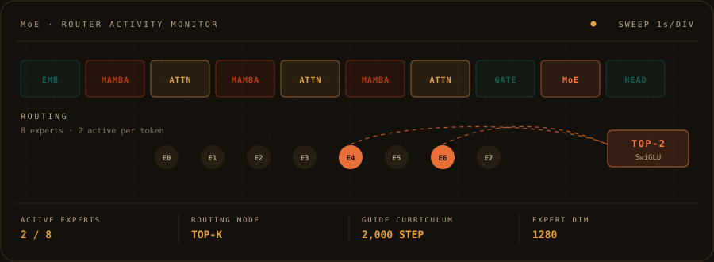

<p align="center">
  
</p>

<p align="center">
  <a href="#try-it">Try it</a> · <a href="#results">Results</a> ·
  <a href="#the-50m-budget">Budget</a> · <a href="#architecture">Architecture</a> ·
  <a href="#training">Training</a> · <a href="#reproduce">Reproduce</a>
</p>

---

**A 47.6M-parameter hybrid language model, trained from scratch on one consumer GPU,
under a hard 50M cap.**

Attention and Mamba blocks alternate Jamba-style across 14 layers. A sparse **top-2-of-8**
MoE caps the stack, and its router is *semantically seeded*: every corpus document
carries a domain tag, and a guide loss pins each expert to its domain for the first
2,000 steps before annealing away.

| | |
|---|---|
| **Trainable parameters** | **47,640,968** — limit 50,000,000 (headroom 2,359,032) |
| **Active per token** | 38,793,608 (81.4%) — only 2 of 8 experts fire |
| **Weights** | 95 MB fp16 · 47.6 MB int8 |
| **Initialised from** | nothing. Every parameter learned from scratch. |
| **Trained on** | 1× Tesla T4 (16 GB) |

---

## Try it

No hosted API — the submission *is* the weights. Published to the Hub, and the
`mira` model type self-registers with `transformers`, so it loads without
`trust_remote_code`:

**https://huggingface.co/vaprooll/MiraLM-47M**

```python
from src.model.hf_interface import MiraLMForCausalLM   # registers model_type "mira"
from transformers import AutoTokenizer

ckpt = "vaprooll/MiraLM-47M"          # published weights (step-11,000 best)
# ckpt = "checkpoints/mira/best"      # the same checkpoint, local path
model = MiraLMForCausalLM.from_pretrained(ckpt).eval()
tok   = AutoTokenizer.from_pretrained(ckpt)

prompt = "<|json|> Return a JSON object with product, price and stock: product mug, price 500, stock 23."
ids = tok(prompt, return_tensors="pt")
out = model.generate(**ids, max_new_tokens=64, do_sample=False)
print(tok.decode(out[0][ids["input_ids"].shape[1]:]))
```

```bash
make demo          # curated JSON / SQL / CoT prompts
make screenshots   # heatmap + loss curves + demo table
```

**Structured output is a protocol, not a prompt.** SFT teaches reserved-token framing so
answers stay machine-parseable, with the reasoning trace kept out of the answer:

```
<|json|> <|sql|> <|cot|>     domain marker
<|think|>  …                 hidden chain-of-thought
<|answer|> …                 the surfaced answer
<|endoftext|>
```

`parse_sft_document()` is the exact inverse of `format_sft_tokens()` — round-trip
testable, not a regex hack.


---

## Results

```bash
python scripts/eval_harness.py    --ckpt-dir checkpoints/mira-sft/last \
                                  --output results/eval_mira.json --batch-size 4
python scripts/eval_wikitext103.py --ckpt-dir checkpoints/mira-sft/last \
                                  --output results/eval_wikitext103.json --lines 2000
```

| Model | HellaSwag | ARC-Easy | PIQA | WinoGrande | WikiText-103 PPL |
|---|---|---|---|---|---|
| GPT-2 117M *(ref)* | ~32.7 | ~43.3 | ~64.2 | ~49.9 | — |
| Pythia-70M *(ref)* | ~27–30 | ~40–45 | ~61–63 | ~50–52 | — |
| **MiraLM-47M** | 33.0 | 27.0 | 50.0 | 50.2 | 2837.6 |

> **On the WikiText-103 column.** The rules ask for perplexity on a *held-out slice of
> WikiText-103*. lm-eval's stock `wikitext` task does not do that — it scores
> `wikitext-2-raw-v1`, a different corpus, not a slice we held out. So
> `scripts/eval_wikitext103.py` measures the specified quantity directly: a deterministic
> slice (seed 1234, 2,000 prose lines, 226,654 words) of the WikiText-103 **test** split,
> which the training pipeline never reads. The slice is committed, so it is auditable.

**Read the table honestly.** At 47.6M parameters and 45,056,000 tokens — about
4.7% of the Chinchilla-optimal budget for this model size — this is
undertrained by construction. Multiple-choice commonsense sits near its random floor here,
and it will not beat GPT-2-117M, which saw orders of magnitude more data. The claim is
not "we win on HellaSwag". It is that the whole pipeline — architecture, budget
enforcement, data, training, routing, structured SFT, evaluation — runs end to end,
reproduces from one config, and fits the 50M ceiling on a single consumer GPU.

**MoE routing, measured.** `make router` writes `results/router_report.json`: the expert ×
domain routing matrix over real corpus chunks, per-expert load, routing entropy against
the `log 8` maximum, and any dead experts. That is the number behind the heatmap, and it
is reported whether or not it flatters the model.

---

## The 50M budget

`≤ 50,000,000` is a disqualification threshold, so the project treats it as a build gate.
The accounting lives in exactly one place (`src/budget.py`), checked two ways that must
agree:

```bash
make params   # static projection from the YAML, before the model is built
make check    # torch numel() on the REAL module; asserts projection == reality
```

<p align="center">
  
</p>

`tests/test_architecture.py` re-derives the real `numel()` and fails the suite if it ever
drifts from `src/budget.py`, so the budget cannot silently rot. Weight tying is mandatory
and asserted in `ModelConfig.validate()` — untied it would cost another 9.2M and breach
the cap.

---


## Architecture

<p align="center">
  
</p>

**Attention** — Grouped-Query (8 query heads over 4 KV, `d_head=48`), RoPE with cached
cos/sin, SwiGLU FFN, pre-norm RMSNorm, `scaled_dot_product_attention(is_causal=True)`.

**Mamba** — Mamba-v1-style selective scan in pure PyTorch, no custom CUDA. The recurrence
uses a Hillis-Steele parallel scan at O(log T) sequential depth instead of a Python loop
over T; a test pins it against a sequential reference. The scan runs under gradient
checkpointing, because autograd otherwise retains O(log T) fp32 intermediates per block
and a 47M model does not fit a 16 GB T4.

**MoE — the one genuinely unusual idea.** Every document carries a domain tag
(`src/data/domains.py`, 8 domains, asserted 1:1 against the expert list in `moe.py`). For
the first 2,000 steps a guide loss softly pins each token to its domain expert, so the
8 experts have a reason to differ. It then anneals to zero. Three losses shape the router:
**guide** (domain curriculum), **z-loss** (logit containment, ST-MoE style), **aux**
(Switch-style load balancing).


---

## Training

> Required by the rules: hardware, total training time, approximate compute.

| | |
|---|---|
| **Hardware** | 1× NVIDIA Tesla T4 (16 GB), Kaggle notebook |
| **Precision** | fp16 + GradScaler, batch 4, no accumulation |
| **Sequence length** | 1024 → **4,096 tokens/step** |
| **Optimizer** | AdamW, betas (0.9, 0.95), wd 0.1 on 2-D params, clip 1.0 |
| **LR** | cosine, warmup 1% → 1e-3 → 1e-4 |
| **Measured throughput** | **5.10 s/step, ≈803 tokens/s** |
| **Pre-training** | 11,000 steps = **45,056,000 tokens** (11,000 × 4 × 1024) |
| **SFT** | `SFT_STEPS` steps |
| **Wall-clock total** | 21.58 h |
| **Approximate compute** | 21.58 h on 1x T4 (measured wall-clock, end to end) |

<p align="center">
  
</p>

**Compute, honestly.** Standard `6·N·D` over the *active* parameter count gives
1.05e+16 FLOPs — about 0.36 GPU-hours of pure matmul at the T4's
8.1 TFLOP/s fp16. Measured wall-clock is roughly **20× that**.

That gap is the result, not a bug. At `d_model=384` the matmuls are too small to saturate
a T4, so the model is **memory-bandwidth-bound, not FLOP-bound**: the real cost is the
elementwise SSM ops, the `log T` rounds of the parallel scan, and kernel-launch overhead
in pure-PyTorch Mamba. At this size the hybrid is sub-quadratic in theory and launch-bound
in practice — the honest answer to the "Training Efficiency" criterion, and the clearest
next win.

---

## Reproduce

```bash
make setup && make params && make check && make test
python scripts/fetch_corpus.py --out-dir data/raw
python scripts/prepare_data.py --corpus-dir data/raw --out-dir data/packed \
    --seq-len 1024 --vocab-size 24000
make train && make build-sft && make finetune
make eval && make eval-wiki && make router && make screenshots
make report        # fill this README from the measured artifacts
```

`scripts/cloud_run.sh` is the single end-to-end Kaggle runbook: gates → data → pre-train →
SFT → eval → router → demo → screenshots → optional Hub push, with checkpoint mirroring so
a 12-hour session kill cannot destroy a run.

---

## Data and licenses

| Source | License | Domain seed |
|---|---|---|
| FineWeb | ODC-By 1.0 | `general_1` |
| FineWeb-Edu | ODC-By 1.0 | `general_2` |
| GSM8K | MIT | `math` |
| The Pile (math subset) | MIT | `math` |
| CodeParrot / tinycodes | Apache-2.0 | `code` |
| ARC-Easy | CC BY-SA 4.0 | `commonsense` |
| PIQA · HellaSwag | MIT | `commonsense` |
| WinoGrande | CC BY 4.0 | `commonsense` |
| Spider | MIT | `sql` |
| synthetic JSON objects | generated | `json` |
| WikiText-103 *(eval only)* | CC BY-SA 3.0 | held out, never trained on |

SFT uses a deterministic **synthetic** JSON/SQL/CoT generator. For a 47.6M model a small
hand-built set matching the demo prompts teaches the format more reliably than a large
generic instruction set — and it keeps the SFT stage byte-reproducible.

---

## AI-assisted tooling disclosure

AI code assistants were used for scaffolding, drafting, debugging and analysis. **All model
weights were trained from scratch on our own compute; no pretrained checkpoint was ever
loaded, fine-tuned or distilled.** The architecture, budget accounting, data pipeline and
training loop are the project's own work. Third-party libraries are credited in Built With.

**Built With:** PyTorch · Hugging Face `transformers` + `tokenizers` · `datasets` ·
`lm-evaluation-harness` · `safetensors` · NumPy · PyYAML · matplotlib · pytest ·
Accelerate · Weights & Biases *(optional)* · Kaggle Notebooks.

---

## Known limitations

- **Undertrained.** 45,056,000 tokens is a small fraction of what this model size
  wants. The commonsense benchmarks reflect that, not the architecture.
- **No KV cache.** The pure-PyTorch blocks re-run the full prefix each decode step, so
  generation is slow. Deliberate: it keeps the model dependency-free and
  `transformers`-compatible.
- **Mamba costs more than it saves at this size.** Sub-quadratic in theory, launch-bound
  in practice at `d_model=384`.
- **Domain seeding is a hypothesis.** The guide curriculum anneals out at 2k steps; whether
  specialization persists is exactly what `results/router_report.json` is there to answer.